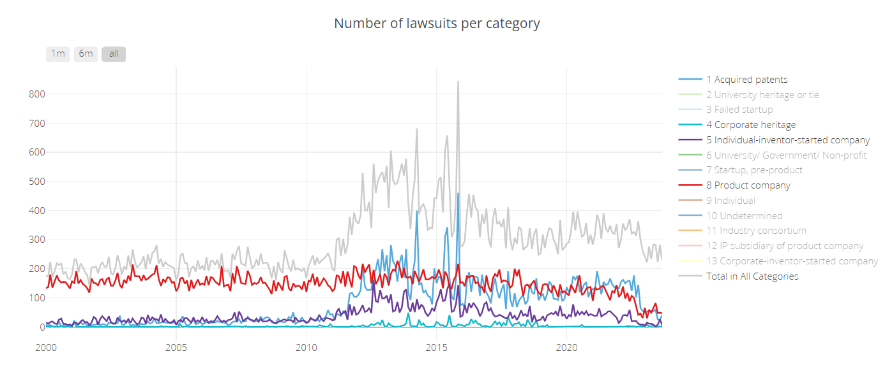
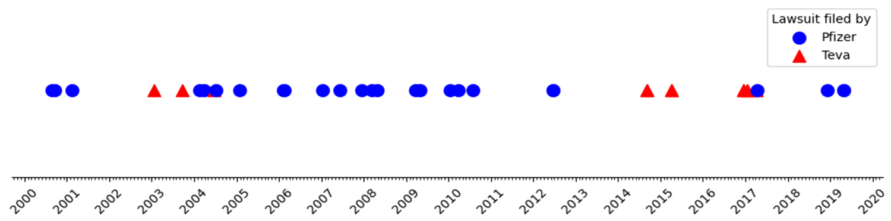

#### Aalto University, School of Science
 

#### CS-E5700 - Hands-on Network Analysis, Spring 2024
 
 
 
 
 
 

# Project 1: Patent war dynamics
 
 

## Team: Valo Hallman, Stanislav Andreev

 
 
 
 

# Final report

 
 
 
 

## Introduction

Commercial competition typically manifests through the continuous improvement of products and services. But there is also an option for direct confrontation, which is litigation. While the hot war is far more destructive in nature, its existence is still a feature rather than a bug. It is there to discourage companies from breaking the rules of market competition. However, since the early 2000’s in the scene of patent litigation, there has been a new trend of abusing this procedure, called patent trolling. Consequently in 2008 Bessen and Meuer argued in their article, that with the exception of the pharma sector, patent litigation might be causing more harm than good [1].

Patent trolling as a term is vague. According to the Stanford NPE Litigation Database [3], patent trolls are "Patent Assertion Entities" (PAEs), which in turn are "Non-Practicing Entities" (NPEs), that employ patents primarily to obtain license fees, rather than to support the transfer or commercialization of technology. We explore the patent war dynamics as a litigation network, using the aforementioned Database.

In 2017 Lee et al. applied complex network theory to analyze the U.S. patent litigation network, revealing its power-law distribution, growth over time, increasing asymmetry due to non-practicing entities and major IT firms, and decreasing Shannon entropy from 2005 to 2016 [2].

## The data

The Stanford NPE Litigation Database [3] tracks every US lawsuit from the year 2000 forward. Lawsuits in the database are analyzed by Stanford student researchers and categorized based on the nature of the plaintiff—distinguishing between trolls, non-trolls, and intermediates. Each record in the database represents a lawsuit, detailing the involved parties, the timing, the patents in question, the category of the asserter, and other pertinent information [3]. We analyzed roughly 100 000 lawsuits with the last lawsuit in the database being from 2021. Many lawsuits contain multiple defendants.

*Picture 1. Volume of different types of lawsuits in the Stanford NPE Litigation Database [3]. Categories 1, 4 and 5 are potential trolls. 8 is a product company, trolls target them.*

Several problematic features of the database could be distinguished as follows:
 - lawsuits information was added manually, which lead to some inconsistencies in the data like placeholders for missing information, typos, different naming conventions, etc.
 - many corporations have multiple subsidiaries, which are not always clearly distinguished in the database

## Results

We process the data by removing the lawsuits with missing information and by merging the subsidiaries of the same corporation (with the help of python package [4] based on Levenshtein distance [5]). It allows us to decrease the number of nodes in the network from 100 000 to 10 000. We then construct a network of lawsuits, where the nodes are the corporations and the edges are the lawsuits.

Based on the network we decided to focus on two scenarios:
 - the patent war between companies
 - the patent trolling

### Patent wars between companies

The first scenario is a straightforward network analysis, where we can identify the most litigious companies, the most targeted companies, and the most litigious industries. We split the data for 3 year periods and analyze the changes in the network over time. In all periods pharmaceutical companies constitute the biggest cluster, which is not surprising, as they are the most innovative and have the most patents. In most of the periods electronics and telecommunication also have a significant number of lawsuits. We also tried to observe dynamics of some significant battles, but the scale of the war cannot strictly be measured by the amount of lawsuits. For example, a famous war between Apple and Samsung with 1.049B$ resolution [6] only saw a total of 6 lawsuits.

*Picture 2. Example of patent war in pharmacological sector between Pfizer and Teva*

### Patent trolling

To analyze the patent trolling we filtered out all the edges, in which both nodes are not potential trolls (categories 1, 4 and 5 in the Stanford NPE Litigation Database [3]). We then analyzed the network of lawsuits between trolls and non-trolls. We calculated classical network metrics like degree and clustering coefficient. We also analyzed the average edge weight dynamics and edges density over time. We have not noticed any significant indicators of patent trolling from such analysis. The network is very sparse and the average edge weight is very low. The edges density is also very low, which means that the trolls are not targeting the same companies over and over again.

*Picture 3. Average degree of the network of lawsuits between trolls and non-trolls over time*

Network visualization of the patent trolling network is a challenging task, as the network is very sparse and the number of nodes is very high. We used gephi [7] to visualize the network, but the results were not very informative. However with some preprocessing and force-directed layout we were able to distinguish some communities (distribution, electronics, movies) in the network (Pictures 4).

*Picture 4. Potential patent trolls network (2000-2004) visualization with force-directed layout*

We also noticed that such communities are not very stable over time, because patent trolls increased number of areas of interest over time (Picture 5).

*Picture 5. Potential patent trolls network (2004-2008) visualization with force-directed layout. Multi-disciplinary trolls are emerging.*

## References

[1]: Patent Failure: How Judges, Bureaucrats and Lawyers Put Innovators at Risk, Bessen & Meuer 2008
https://www.researchgate.net/publication/24118019_Patent_Failure_How_Judges_Bureaucrats_and_Lawyers_Put_Innovators_at_Risk

[2]: Scale-free network analysis of big data for patent litigation cases in the United States, Lee D. et al. 2017 https://link.springer.com/article/10.3938/jkps.70.431

[3]: Stanford NPE Litigation Database website https://npe.law.stanford.edu/

[4]: Python package for string matching https://pypi.org/project/fuzzywuzzy/

[5]: Levenshtein, Vladimir I. (February 1966). "Binary codes capable of correcting deletions, insertions, and reversals". Soviet Physics Doklady. 10 (8): 707–710. Bibcode:1966SPhD...10..707L.

[6]: Apple vs Samsung, wikipedia https://en.wikipedia.org/wiki/Apple_Inc._v._Samsung_Electronics_Co

[7]: Graph visualization software https://gephi.org/
